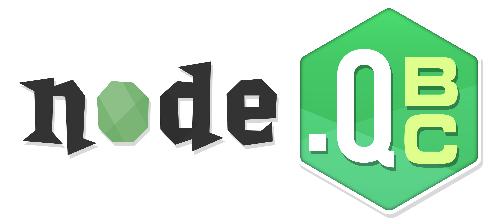

<div align="center"></div>

-----

## 🗒️ About

**NodeQBC** is a node.js version of (404 Repo Not Found)

As a full-fledged compiler and decompiler, **NodeQBC** aims to smoothly handle serializing and deserializing of files used in Neversoft's *QScript* language.

**Features:**

- 🖥️ - Compiles from `.q` source code to `.qb` bytecode
- 🗒️ - Decompiles from `.qb` bytecode to readable `.q` source code
- 📖 - Syntax that aims to closely replicate Neversoft's original `.q` script as much as possible
- ✏️ - Supports single-line and block comments
- 🌐 - Handles symbol-table elements with identical syntax to script elements
- 📜 - Compiling and decompiling of scripts, not just variables!

**Supported Games:**

- **NodeQBC** targets games from *Tony Hawk's American Wasteland* and on. This tool will **NOT** work with older Neversoft titles such as *Tony Hawk's Underground 2*.

## 🧰 Prerequisites

Being a node.js application, **NodeQBC** requires [node.js](https://nodejs.org/en) to be installed.

## 📗 Usage

**NodeQBC** can be called from the command-line within the main folder using:

```
node QBC.js
```

### Compiling:

```
node QBC.js compile my_file.q
```
The compiled QScript file will be output to `my_file.qb`.

```
node QBC.js compile my_file.q -o qb_output.qb.xen
```
The compiled QScript file will be output to `qb_output.qb.xen`.

-----

**Game Types:**

**NodeQBC** can compile bytecode differently depending on the target game. Use the `-g` parameter with a game below:

- `ghwt` - Guitar Hero: World Tour
- `gh3` - Guitar Hero III: Legends of Rock
- `thaw` - Tony Hawk's American Wasteland
- `thug2` - Tony Hawk's Underground 2 **(Decompile ONLY)**

### Decompiling:

```
node QBC.js decompile my_file.qb.xen
```
The decompiled QScript file will be output to `my_file.q`.

### Other:

For further help, use the `help` command:

```
node QBC.js help
```
